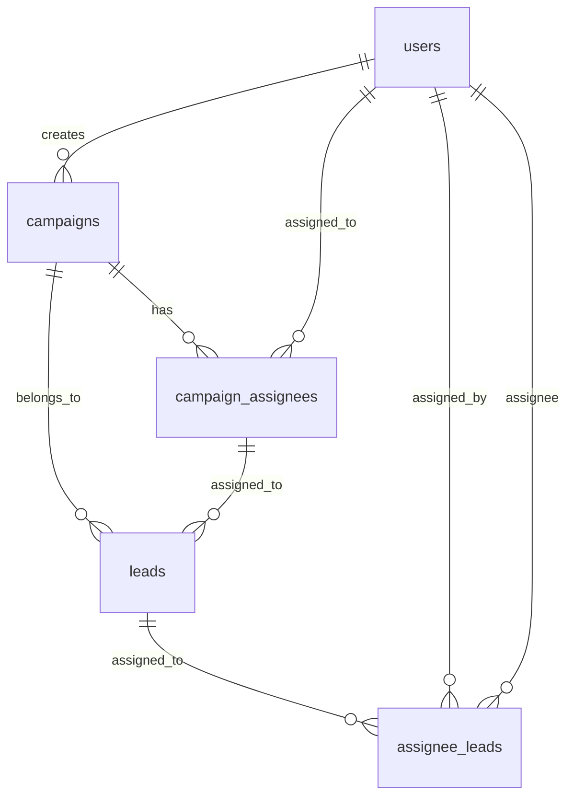

# Database Schema Documentation

## Overview

This document provides detailed information about the CRM System database schema, including table structures, relationships, indexes, and constraints.

## Database Information

- **Database Name**: `crm_system`
- **Engine**: MySQL 8.0+
- **Character Set**: UTF-8
- **Collation**: utf8mb4_unicode_ci

## Table Relationships



## Core Tables

### 1. users

Stores user account information and authentication data.

```sql
CREATE TABLE users (
  id INT PRIMARY KEY AUTO_INCREMENT,
  name VARCHAR(255) NOT NULL,
  email VARCHAR(255) UNIQUE NOT NULL,
  password VARCHAR(255) NOT NULL,
  initials VARCHAR(10),
  role ENUM('admin', 'manager', 'supervisor', 'caller') NOT NULL,
  phone VARCHAR(20),
  country_code VARCHAR(5),
  created_at TIMESTAMP DEFAULT CURRENT_TIMESTAMP,
  updated_at TIMESTAMP DEFAULT CURRENT_TIMESTAMP ON UPDATE CURRENT_TIMESTAMP
);
```

**Columns:**
- `id`: Primary key, auto-incrementing
- `name`: User's full name (required)
- `email`: Unique email address (required)
- `password`: Hashed password using bcrypt (required)
- `initials`: Auto-generated from name if not provided
- `role`: User role with specific permissions
- `phone`: Contact phone number
- `country_code`: Country calling code
- `created_at`: Record creation timestamp
- `updated_at`: Record last update timestamp

**Indexes:**
- Primary Key: `id`
- Unique: `email`
- Index: `role` (for role-based queries)

**Triggers:**
- Auto-generate initials from name if not provided
- Update `updated_at` timestamp on record modification

### 2. campaigns

Stores marketing campaign information.

```sql
CREATE TABLE campaigns (
  id INT PRIMARY KEY AUTO_INCREMENT,
  name VARCHAR(255) NOT NULL,
  description TEXT,
  status ENUM('active', 'inactive', 'completed') DEFAULT 'active',
  created_by INT,
  created_at TIMESTAMP DEFAULT CURRENT_TIMESTAMP,
  updated_at TIMESTAMP DEFAULT CURRENT_TIMESTAMP ON UPDATE CURRENT_TIMESTAMP,
  FOREIGN KEY (created_by) REFERENCES users(id)
);
```

**Columns:**
- `id`: Primary key, auto-incrementing
- `name`: Campaign name (required)
- `description`: Campaign description
- `status`: Campaign status (active/inactive/completed)
- `created_by`: User who created the campaign
- `created_at`: Record creation timestamp
- `updated_at`: Record last update timestamp

**Foreign Keys:**
- `created_by` → `users(id)`

**Indexes:**
- Primary Key: `id`
- Index: `status` (for status-based queries)
- Index: `created_by` (for user-based queries)

### 3. leads

Stores lead information and contact details.

```sql
CREATE TABLE leads (
  id INT PRIMARY KEY AUTO_INCREMENT,
  name VARCHAR(255) NOT NULL,
  email VARCHAR(255),
  phone VARCHAR(20),
  company VARCHAR(255),
  status ENUM('fresh', 'contacted', 'qualified', 'won', 'lost') DEFAULT 'fresh',
  campaign_id INT,
  assigned_to INT,
  created_at TIMESTAMP DEFAULT CURRENT_TIMESTAMP,
  updated_at TIMESTAMP DEFAULT CURRENT_TIMESTAMP ON UPDATE CURRENT_TIMESTAMP,
  FOREIGN KEY (campaign_id) REFERENCES campaigns(id),
  FOREIGN KEY (assigned_to) REFERENCES campaign_assignees(id)
);
```

**Columns:**
- `id`: Primary key, auto-incrementing
- `name`: Lead's full name (required)
- `email`: Lead's email address
- `phone`: Lead's phone number
- `company`: Lead's company name
- `status`: Lead status in the sales funnel
- `campaign_id`: Associated campaign
- `assigned_to`: Assigned campaign assignee
- `created_at`: Record creation timestamp
- `updated_at`: Record last update timestamp

**Foreign Keys:**
- `campaign_id` → `campaigns(id)`
- `assigned_to` → `campaign_assignees(id)`

**Indexes:**
- Primary Key: `id`
- Index: `campaign_id` (for campaign-based queries)
- Index: `assigned_to` (for assignment-based queries)
- Index: `status` (for status-based queries)
- Index: `email` (for email-based queries)

### 4. campaign_assignees

Links users to campaigns for assignment purposes.

```sql
CREATE TABLE campaign_assignees (
  id INT PRIMARY KEY AUTO_INCREMENT,
  campaign_id INT NOT NULL,
  user_id INT NOT NULL,
  is_active BOOLEAN DEFAULT TRUE,
  assigned_at TIMESTAMP DEFAULT CURRENT_TIMESTAMP,
  FOREIGN KEY (campaign_id) REFERENCES campaigns(id),
  FOREIGN KEY (user_id) REFERENCES users(id)
);
```

**Columns:**
- `id`: Primary key, auto-incrementing
- `campaign_id`: Associated campaign (required)
- `user_id`: Assigned user (required)
- `is_active`: Whether the assignment is active
- `assigned_at`: Assignment timestamp

**Foreign Keys:**
- `campaign_id` → `campaigns(id)`
- `user_id` → `users(id)`

**Indexes:**
- Primary Key: `id`
- Unique: `(campaign_id, user_id)` (prevent duplicate assignments)
- Index: `campaign_id` (for campaign-based queries)
- Index: `user_id` (for user-based queries)
- Index: `is_active` (for active assignment queries)

### 5. assignee_leads

Tracks lead assignments and follow-up activities.

```sql
CREATE TABLE assignee_leads (
  id INT PRIMARY KEY AUTO_INCREMENT,
  campaign_id INT NOT NULL,
  assignee_id INT NOT NULL,
  lead_id INT NOT NULL,
  assigned_by INT NOT NULL,
  status ENUM('Fresh', 'Follow Up', 'Done', 'Cancel') DEFAULT 'Fresh',
  notes TEXT,
  created_at TIMESTAMP DEFAULT CURRENT_TIMESTAMP,
  updated_at TIMESTAMP DEFAULT CURRENT_TIMESTAMP ON UPDATE CURRENT_TIMESTAMP,
  FOREIGN KEY (campaign_id) REFERENCES campaigns(id),
  FOREIGN KEY (assignee_id) REFERENCES users(id),
  FOREIGN KEY (lead_id) REFERENCES leads(id),
  FOREIGN KEY (assigned_by) REFERENCES users(id)
);
```

**Columns:**
- `id`: Primary key, auto-incrementing
- `campaign_id`: Associated campaign (required)
- `assignee_id`: Assigned user (required)
- `lead_id`: Associated lead (required)
- `assigned_by`: User who made the assignment (required)
- `status`: Follow-up status
- `notes`: Follow-up notes and comments
- `created_at`: Record creation timestamp
- `updated_at`: Record last update timestamp

**Foreign Keys:**
- `campaign_id` → `campaigns(id)`
- `assignee_id` → `users(id)`
- `lead_id` → `leads(id)`
- `assigned_by` → `users(id)`

**Indexes:**
- Primary Key: `id`
- Unique: `(campaign_id, assignee_id, lead_id)` (prevent duplicate assignments)
- Index: `campaign_id` (for campaign-based queries)
- Index: `assignee_id` (for assignee-based queries)
- Index: `lead_id` (for lead-based queries)
- Index: `assigned_by` (for assignment tracking)
- Index: `status` (for status-based queries)

## Additional Tables

### 6. filter_users

Stores filter user data for lead filtering purposes.

```sql
CREATE TABLE filter_users (
  id INT PRIMARY KEY AUTO_INCREMENT,
  name VARCHAR(255) NOT NULL,
  email VARCHAR(255),
  phone VARCHAR(20),
  date DATE,
  created_at TIMESTAMP DEFAULT CURRENT_TIMESTAMP,
  updated_at TIMESTAMP DEFAULT CURRENT_TIMESTAMP ON UPDATE CURRENT_TIMESTAMP
);
```

**Columns:**
- `id`: Primary key, auto-incrementing
- `name`: Filter user name (required)
- `email`: Filter user email
- `phone`: Filter user phone
- `date`: Filter date
- `created_at`: Record creation timestamp
- `updated_at`: Record last update timestamp

**Indexes:**
- Primary Key: `id`
- Index: `email` (for email-based queries)
- Index: `date` (for date-based queries)

### 7. donors

Stores donor information and donation details.

```sql
CREATE TABLE donors (
  id INT PRIMARY KEY AUTO_INCREMENT,
  name VARCHAR(255) NOT NULL,
  email VARCHAR(255),
  phone VARCHAR(20),
  amount DECIMAL(10,2),
  donation_date DATE,
  status ENUM('pending', 'verified', 'rejected') DEFAULT 'pending',
  created_at TIMESTAMP DEFAULT CURRENT_TIMESTAMP,
  updated_at TIMESTAMP DEFAULT CURRENT_TIMESTAMP ON UPDATE CURRENT_TIMESTAMP
);
```

**Columns:**
- `id`: Primary key, auto-incrementing
- `name`: Donor name (required)
- `email`: Donor email
- `phone`: Donor phone
- `amount`: Donation amount
- `donation_date`: Date of donation
- `status`: Donation verification status
- `created_at`: Record creation timestamp
- `updated_at`: Record last update timestamp

**Indexes:**
- Primary Key: `id`
- Index: `email` (for email-based queries)
- Index: `donation_date` (for date-based queries)
- Index: `status` (for status-based queries)

### 8. prasadam

Stores prasadam distribution and tracking information.

```sql
CREATE TABLE prasadam (
  id INT PRIMARY KEY AUTO_INCREMENT,
  donor_name VARCHAR(255) NOT NULL,
  donation_date DATE,
  status ENUM('pending', 'verified', 'sent') DEFAULT 'pending',
  images ENUM('not_sent', 'sent') DEFAULT 'not_sent',
  email ENUM('no', 'yes') DEFAULT 'no',
  created_at TIMESTAMP DEFAULT CURRENT_TIMESTAMP,
  updated_at TIMESTAMP DEFAULT CURRENT_TIMESTAMP ON UPDATE CURRENT_TIMESTAMP
);
```

**Columns:**
- `id`: Primary key, auto-incrementing
- `donor_name`: Donor name (required)
- `donation_date`: Date of donation
- `status`: Prasadam status
- `images`: Whether images were sent
- `email`: Whether email was sent
- `created_at`: Record creation timestamp
- `updated_at`: Record last update timestamp

**Indexes:**
- Primary Key: `id`
- Index: `donation_date` (for date-based queries)
- Index: `status` (for status-based queries)

## Views

### 1. lead_summary_view

Provides a summary view of leads with campaign and assignee information.

```sql
CREATE VIEW lead_summary_view AS
SELECT 
  l.id,
  l.name,
  l.email,
  l.phone,
  l.company,
  l.status as lead_status,
  c.name as campaign_name,
  u.name as assignee_name,
  l.created_at
FROM leads l
LEFT JOIN campaigns c ON l.campaign_id = c.id
LEFT JOIN campaign_assignees ca ON l.assigned_to = ca.id
LEFT JOIN users u ON ca.user_id = u.id;
```

### 2. assignee_performance_view

Provides performance metrics for assignees.

```sql
CREATE VIEW assignee_performance_view AS
SELECT 
  u.id as user_id,
  u.name as assignee_name,
  COUNT(al.id) as total_leads,
  COUNT(CASE WHEN al.status = 'Fresh' THEN 1 END) as fresh_leads,
  COUNT(CASE WHEN al.status = 'Follow Up' THEN 1 END) as follow_up_leads,
  COUNT(CASE WHEN al.status = 'Done' THEN 1 END) as done_leads,
  COUNT(CASE WHEN al.status = 'Cancel' THEN 1 END) as cancel_leads
FROM users u
LEFT JOIN assignee_leads al ON u.id = al.assignee_id
WHERE u.role IN ('caller', 'manager', 'supervisor')
GROUP BY u.id, u.name;
```

## Stored Procedures

### 1. assign_leads_to_campaign

Automatically assigns leads to campaign assignees using round-robin distribution.

```sql
DELIMITER //
CREATE PROCEDURE assign_leads_to_campaign(
  IN p_campaign_id INT,
  IN p_assignee_ids JSON
)
BEGIN
  DECLARE done INT DEFAULT FALSE;
  DECLARE lead_id INT;
  DECLARE assignee_index INT DEFAULT 0;
  DECLARE assignee_count INT;
  DECLARE assignee_id INT;
  
  -- Get assignee count
  SET assignee_count = JSON_LENGTH(p_assignee_ids);
  
  -- Cursor for unassigned leads
  DECLARE lead_cursor CURSOR FOR
    SELECT id FROM leads 
    WHERE campaign_id = p_campaign_id 
    AND assigned_to IS NULL;
  
  DECLARE CONTINUE HANDLER FOR NOT FOUND SET done = TRUE;
  
  OPEN lead_cursor;
  
  read_loop: LOOP
    FETCH lead_cursor INTO lead_id;
    IF done THEN
      LEAVE read_loop;
    END IF;
    
    -- Get assignee ID using round-robin
    SET assignee_id = JSON_EXTRACT(p_assignee_ids, CONCAT('$[', assignee_index, ']'));
    
    -- Create assignee_lead record
    INSERT INTO assignee_leads (campaign_id, assignee_id, lead_id, assigned_by, status)
    VALUES (p_campaign_id, assignee_id, lead_id, 1, 'Fresh');
    
    -- Update lead assignment
    UPDATE leads SET assigned_to = (
      SELECT id FROM campaign_assignees 
      WHERE campaign_id = p_campaign_id AND user_id = assignee_id
    ) WHERE id = lead_id;
    
    -- Move to next assignee
    SET assignee_index = (assignee_index + 1) % assignee_count;
  END LOOP;
  
  CLOSE lead_cursor;
END //
DELIMITER ;
```

### 2. get_campaign_statistics

Returns comprehensive statistics for a campaign.

```sql
DELIMITER //
CREATE PROCEDURE get_campaign_statistics(
  IN p_campaign_id INT
)
BEGIN
  SELECT 
    c.name as campaign_name,
    COUNT(l.id) as total_leads,
    COUNT(CASE WHEN l.status = 'fresh' THEN 1 END) as fresh_leads,
    COUNT(CASE WHEN l.status = 'contacted' THEN 1 END) as contacted_leads,
    COUNT(CASE WHEN l.status = 'qualified' THEN 1 END) as qualified_leads,
    COUNT(CASE WHEN l.status = 'won' THEN 1 END) as won_leads,
    COUNT(CASE WHEN l.status = 'lost' THEN 1 END) as lost_leads,
    COUNT(DISTINCT ca.user_id) as total_assignees
  FROM campaigns c
  LEFT JOIN leads l ON c.id = l.campaign_id
  LEFT JOIN campaign_assignees ca ON c.id = ca.campaign_id
  WHERE c.id = p_campaign_id
  GROUP BY c.id, c.name;
END //
DELIMITER ;
```

## Triggers

### 1. update_user_initials

Automatically generates user initials from name if not provided.

```sql
DELIMITER //
CREATE TRIGGER update_user_initials
BEFORE INSERT ON users
FOR EACH ROW
BEGIN
  IF NEW.initials IS NULL OR NEW.initials = '' THEN
    SET NEW.initials = UPPER(
      CONCAT(
        LEFT(NEW.name, 1),
        CASE 
          WHEN LOCATE(' ', NEW.name) > 0 
          THEN LEFT(SUBSTRING(NEW.name, LOCATE(' ', NEW.name) + 1), 1)
          ELSE ''
        END
      )
    );
  END IF;
END //
DELIMITER ;
```

### 2. update_lead_assignment

Updates lead assignment when assignee_lead is created.

```sql
DELIMITER //
CREATE TRIGGER update_lead_assignment
AFTER INSERT ON assignee_leads
FOR EACH ROW
BEGIN
  UPDATE leads 
  SET assigned_to = (
    SELECT id FROM campaign_assignees 
    WHERE campaign_id = NEW.campaign_id AND user_id = NEW.assignee_id
  )
  WHERE id = NEW.lead_id;
END //
DELIMITER ;
```

## Indexes and Performance

### Recommended Indexes

```sql
-- Composite indexes for common query patterns
CREATE INDEX idx_leads_campaign_status ON leads(campaign_id, status);
CREATE INDEX idx_assignee_leads_assignee_status ON assignee_leads(assignee_id, status);
CREATE INDEX idx_campaign_assignees_campaign_active ON campaign_assignees(campaign_id, is_active);

-- Full-text search indexes
CREATE FULLTEXT INDEX idx_leads_search ON leads(name, email, company);
CREATE FULLTEXT INDEX idx_users_search ON users(name, email);
```

### Performance Optimization

1. **Query Optimization**: Use EXPLAIN to analyze query performance
2. **Index Usage**: Monitor index usage with SHOW INDEX
3. **Connection Pooling**: Use connection pooling for better performance
4. **Regular Maintenance**: Run OPTIMIZE TABLE periodically

## Backup and Recovery

### Backup Strategy

```bash
# Daily backup
mysqldump -u username -p crm_system > backup_$(date +%Y%m%d).sql

# Weekly backup with compression
mysqldump -u username -p crm_system | gzip > backup_$(date +%Y%m%d).sql.gz
```

### Recovery Procedures

```bash
# Restore from backup
mysql -u username -p crm_system < backup_20240115.sql

# Restore from compressed backup
gunzip < backup_20240115.sql.gz | mysql -u username -p crm_system
```

## Security Considerations

1. **Password Hashing**: All passwords are hashed using bcrypt
2. **SQL Injection Prevention**: Use parameterized queries
3. **Access Control**: Implement role-based access control
4. **Audit Logging**: Log all database modifications
5. **Encryption**: Encrypt sensitive data at rest

## Migration Scripts

### Version 1.0 to 1.1

```sql
-- Add new columns
ALTER TABLE users ADD COLUMN country_code VARCHAR(5) AFTER phone;
ALTER TABLE leads ADD COLUMN company VARCHAR(255) AFTER phone;

-- Add new indexes
CREATE INDEX idx_leads_email ON leads(email);
CREATE INDEX idx_users_role ON users(role);
```

### Version 1.1 to 1.2

```sql
-- Add new enum values
ALTER TABLE leads MODIFY COLUMN status ENUM('fresh', 'contacted', 'qualified', 'won', 'lost') DEFAULT 'fresh';

-- Add new table
CREATE TABLE filter_users (
  -- table definition
);
```

## Monitoring and Maintenance

### Health Checks

```sql
-- Check table sizes
SELECT 
  table_name,
  ROUND(((data_length + index_length) / 1024 / 1024), 2) AS 'Size (MB)'
FROM information_schema.tables 
WHERE table_schema = 'crm_system';

-- Check slow queries
SHOW PROCESSLIST;

-- Check index usage
SHOW INDEX FROM leads;
```

### Regular Maintenance

1. **Weekly**: Analyze table statistics
2. **Monthly**: Optimize tables
3. **Quarterly**: Review and update indexes
4. **Annually**: Archive old data

## Troubleshooting

### Common Issues

1. **Foreign Key Constraint Errors**: Check referenced data exists
2. **Duplicate Key Errors**: Check unique constraints
3. **Performance Issues**: Analyze slow queries
4. **Connection Issues**: Check connection limits

### Debug Queries

```sql
-- Check foreign key relationships
SELECT 
  TABLE_NAME,
  COLUMN_NAME,
  CONSTRAINT_NAME,
  REFERENCED_TABLE_NAME,
  REFERENCED_COLUMN_NAME
FROM information_schema.KEY_COLUMN_USAGE
WHERE REFERENCED_TABLE_SCHEMA = 'crm_system';

-- Check table structure
DESCRIBE users;
SHOW CREATE TABLE leads;
```
